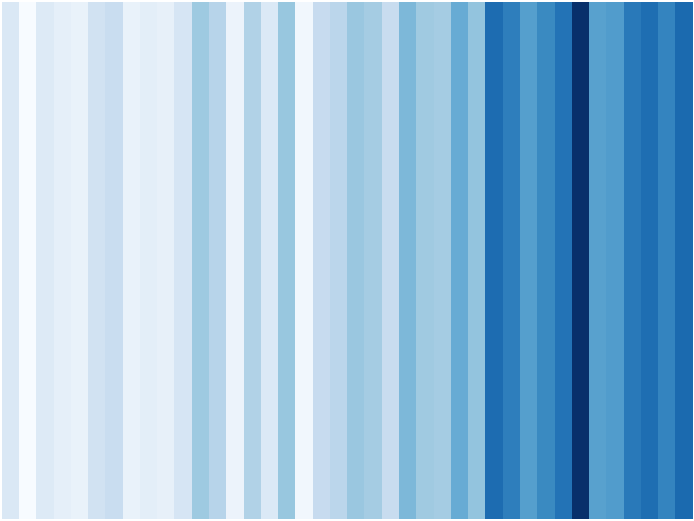
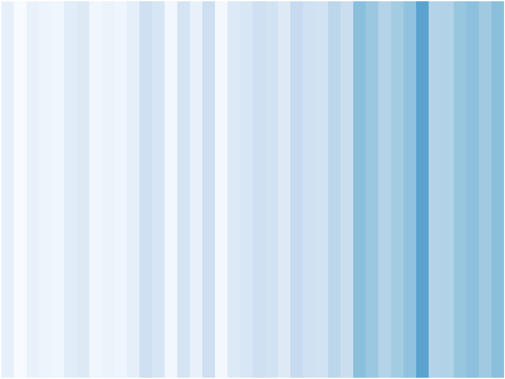

Inspired by the warming stripes by [Ed Hawkins](https://www.climate-lab-book.ac.uk/2018/warming-stripes/),
[Sebastian Bayer](https://github.com/sebastianbeyer) used the data from the german weather service (DWD) and wrote a small script to visualize the changes in temperature for Germany. [Thomas Rackow](https://github.com/trackow) added the melting stripes for visualizing Arctic Sea Ice decrease. The sea ice figures below are based on data from AWI's [Sea Ice Portal](https://seaiceportal.de). All steps to reproduce the plots are available in a [Jupyter notebook](https://github.com/trackow/warmingstripes/blob/master/MeltingStripes.ipynb).

### Germany

### Berlin/Brandenburg

### Bremen

### Arctic Sea Ice Extent, 1979-2018, using (vmin,vmax)=(3.49, 7.7)=(blue,white)

### Arctic Sea Ice Extent, 1979-2018, using (vmin,vmax)=(0, 7.7)=(blue,white)

